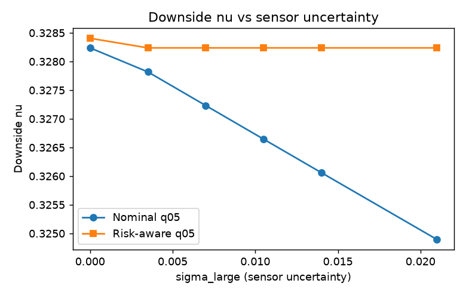
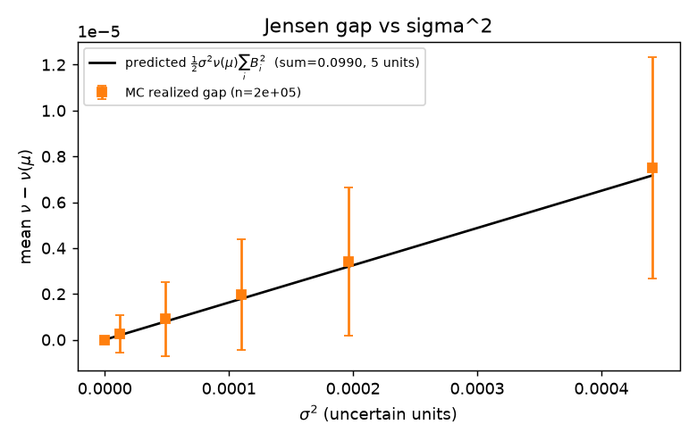

# Risk-Aware Sensor Placement Under Capability Uncertainty

The baseline (Kim et al., SysCon 2025) places sensors to maximize void probability $\nu$, assuming each sensor's
detection capability $\rho_i$ is known. This study models $\rho_i \sim \mathcal{N}(\mu_i, \sigma_i^2)$
and asks whether that uncertainty changes the placement. It does not move the mean-optimal placement. It moves the tail. The risk-aware planner holds the downside flat where the nominal planner
degrades, and the gap has a closed form as seen in the simulation results.

## The loop

- **Formalize.** $\rho_i \sim \mathcal{N}(\mu_i, \sigma_i^2)$. Carry the belief through $\nu$ and through
  expected detection coverage $D$.
- **Derive.** Three results fall out: a closed-form Jensen gap, a collapse, and a broken guarantee.
- **Implement.** Greedy nominal planner ($\nu$ at the belief mean) against a risk-aware planner
  ($\mathbb{E}[\nu] - \kappa\,\mathrm{Std}[\nu]$), Monte Carlo over the belief.
- **Validate.** The simulation reproduces the derived gap and shows where the two planners diverge.

## Result

Expected coverage is linear in capability, so the expected-coverage planner collapses onto the nominal
one — uncertainty does not move the placement geometry. The mean void probability is identical across
planners ($\approx 0.3284$). The difference is in the tail.



*Risk-aware $q_{05}$ holds flat as $\sigma$ grows; nominal $q_{05}$ drops. The 5th-percentile void
probability is the worst-case detection the placement guarantees under the belief.*



*Closed-form gap $\tfrac{1}{2}\sigma^2 \nu(\mu)\sum_i B_i^2$ (line) against Monte Carlo (markers, $n=2\times10^5$).*

| $\sigma_\text{large}$ | nominal $q_{05}$ | risk-aware $q_{05}$ | $q_{05}$ gap |
|---|---|---|---|
| 0.0000 | 0.32824 | 0.32841 | +0.00017 |
| 0.0070 | 0.32723 | 0.32824 | +0.00101 |
| 0.0140 | 0.32606 | 0.32824 | +0.00218 |
| 0.0210 | 0.32489 | 0.32824 | +0.00334 |

## Reproduce
Approx. 2min run. Regenerates figures/ and prints both tables;
```bash
pip install -r requirements.txt
python sensor_placement.py
```

## What the analysis establishes

- **Expected $\equiv$ Nominal.** $\mathbb{E}_\rho[D(a)] = D(a;\mu)$. Expected detection coverage is
  linear in capability, so planning against the belief mean and planning against the full belief select
  the same sensors. Capability uncertainty is invisible to a mean-optimal objective.
- **The tail is where uncertainty lives.** Penalizing $\mathrm{Std}[\nu]$ trades nothing in the mean and
  buys a flat downside. The $q_{05}$ gap grows monotonically with $\sigma$.
- **Jensen gap, closed form.** The Gaussian MGF gives a per-sensor gap
  $\nu(\mu_i)\big(e^{\frac{1}{2}B_i^2\sigma_i^2} - 1\big) \approx \tfrac{1}{2}B_i^2\sigma_i^2\nu(\mu_i)$,
  with $B_i$ the marginal sensitivity of the undetected mass to sensor $i$'s capability. Independent
  sensors make the total gap additive.
- **Submodularity does not transfer.** $D$ is monotone submodular, so greedy gets the $(1-1/e)$
  guarantee on coverage. The convex transform in the risk-aware objective breaks submodularity; the
  guarantee does not carry over.

## Source/Report

- Kim, Stilwell, Yetkin, Jimenez. *Near-optimal Sensor Placement for Detecting Stochastic Target
  Trajectories in Barrier Coverage Systems.* SysCon 2025. doi: [https://doi.org/10.1109/syscon64521.2025.11014804](https://doi.org/10.1109/syscon64521.2025.11014804)
- Full derivations and discussion: [`report/risk_aware_sensor_placement.pdf`](report/risk_aware_sensor_placement.pdf)
